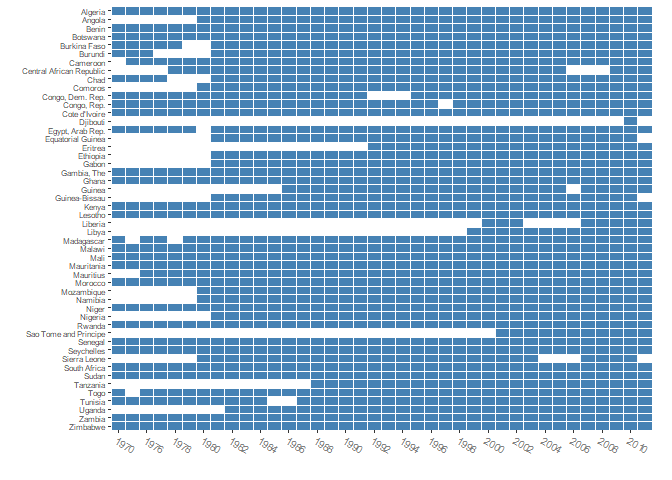
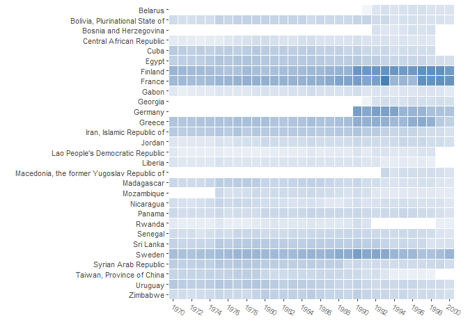
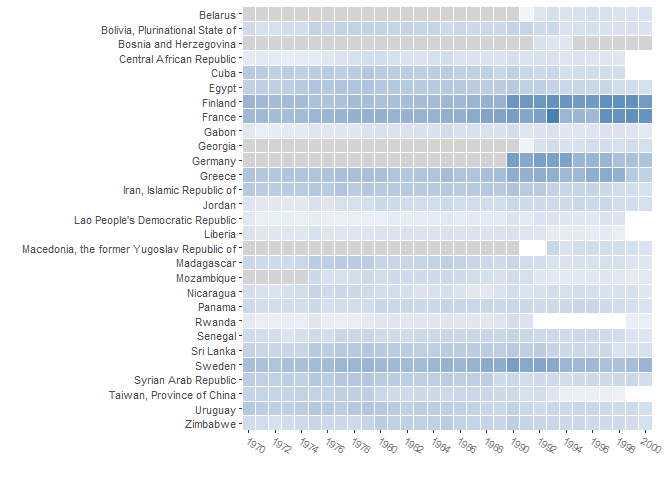
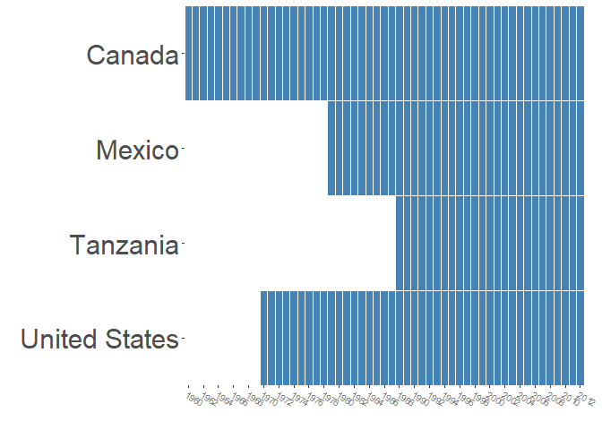

Coverage
================
Sondre U. Solstad

An R package for seeing what you're missing
===========================================

The coverage package and associated function provides you with a summary of your time and unit coverage. This is important for any analysis conducted with row-wise deletion in the presence of missing data, especially if one suspect that patterns of missingness are non-random with respect to variables of interest. Examples of such analysis include standard regression analysis and most implementations of maximum likelihood. By default, the function provides a data frame of unit and time coverage ("coverage.df") and a summary of time coverage by unit ("coverage.summary"). It can also additionally supply a latex table or a visualization of coverage. Finally, the function also supports 3-dimensional data by providing total number of observations in tables, and a "heatmap" of observations in visual.

Installation instructions:

``` r
library(devtools)
install_github("sondreus/coverage")
```


-   *An example of row-wise coverage in technology-country-year data*

Arguments:
----------

-   **fit** A fitted object. Currently supports base R **lm()**.
-   **timevar** - Your time variable.
-   **unitvar** - Your unit variable.
-   **data** - Data to be investigated. If none is supplied, defaults to data used in "**fit**" if fit is in supported format.
-   **variable.names** - Variables to be checked for coverage. If none is supplied, defaults to variables used in **fit**.
-   **output** - Desired output: "visual" or "latex.table". Former depends on requires the package **ggplot2**, latter requires the package **stargazer**, both available on CRAN.
-   **special.NA** - Variable that if missing will indicate "special" missingness if "visual" output is specified. Can be used to distinguish observations with missing data from time-unit combinations which did not exist or were not considered.
-   **visual.source** - If TRUE, prints ggplot2 code used to create visual.

Example
-------

Let's see how this package works through a simple application. We begin by getting some data from the World Bank Development Indicators, using the WDI package (by Vincent Arel-Bundock). Let's get data on GDP per capita, trade in services as a percentage of GDP, adult female literacy rates, agriculture as a percentage of GDP, and finally, number of telephone subscriptions per 1000 people.

``` r
library("WDI", quietly = TRUE)
wdi.sample <- WDI(indicator=c('NY.GDP.PCAP.KD',
                              'BG.GSR.NFSV.GD.ZS',
                              'SE.ADT.LITR.FE.ZS',
                              'NV.AGR.TOTL.ZS',
                              'IT.TEL.TOTL.P3'),

                              country=c('MX','CA',
                              'US','TZ'),

                              start=1950, end=2012)

 colnames(wdi.sample)[4:8] <- c("GDPPC",
                                "services_gdp",
                                "literacy_women",
                                "agriculture_gdp",
                                "telephones")
```

Suppose we next are interested in how well "trade in services as a percentage of GDP" predicts "GDP per capita".

``` r
lm.fit <- lm(GDPPC ~ services_gdp, data = wdi.sample)
summary(lm.fit)
```

    ## 
    ## Call:
    ## lm(formula = GDPPC ~ services_gdp, data = wdi.sample)
    ## 
    ## Residuals:
    ##      Min       1Q   Median       3Q      Max 
    ## -23454.6 -16054.0   -688.3  12475.8  29269.1 
    ## 
    ## Coefficients:
    ##              Estimate Std. Error t value Pr(>|t|)    
    ## (Intercept)   33306.9     2595.1  12.834  < 2e-16 ***
    ## services_gdp  -1256.0      297.4  -4.224 4.11e-05 ***
    ## ---
    ## Signif. codes:  0 '***' 0.001 '**' 0.01 '*' 0.05 '.' 0.1 ' ' 1
    ## 
    ## Residual standard error: 15850 on 153 degrees of freedom
    ##   (57 observations deleted due to missingness)
    ## Multiple R-squared:  0.1044, Adjusted R-squared:  0.09857 
    ## F-statistic: 17.84 on 1 and 153 DF,  p-value: 4.112e-05

So we have some data and a statistically significant relationship. But which country-years is this relationship based on? One option would be to inspect the data manually, which is viable only if the number of units (countries) and time points (years) are both small. And even in such a case, it is still very tidious. Let's instead apply the coverage function:

``` r
library("coverage")
 coverage(fit = lm.fit, timevar = "year",
          unitvar = "country")

 coverage.summary
```

    ##            Unit Total Observations Total time coverage Covered time 
    ## 1        Canada                 53                  53     1960-2012
    ## 3        Mexico                 34                  34     1979-2012
    ## 4      Tanzania                 25                  25     1988-2012
    ## 2 United States                 43                  43     1970-2012

Let us also request a visual representation:

``` r
 library("ggplot2", verbose = FALSE)
 
 coverage(fit = lm.fit, timevar = "year",
         unitvar = "country", output = "visual")
```


Or a latex table:

``` r
 library("stargazer", quietly = TRUE)
 coverage(fit = lm.fit, timevar = "year",
          unitvar = "country", output = "latex.table")
```

    ## 
    ## % Table created by stargazer v.5.2 by Marek Hlavac, Harvard University. E-mail: hlavac at fas.harvard.edu
    ## % Date and time: Wed, Dec 14, 2016 - 3:05:23 PM
    ## \begin{table}[!htbp] \centering 
    ##   \caption{} 
    ##   \label{} 
    ## \tiny 
    ## \begin{tabular}{@{\extracolsep{5pt}} cccc} 
    ## \\[-1.8ex]\hline 
    ## \hline \\[-1.8ex] 
    ## Unit & Total Observations & Total time coverage & Covered time  \\ 
    ## \hline \\[-1.8ex] 
    ## Canada & $53$ & $53$ & 1960-2012 \\ 
    ## United States & $43$ & $43$ & 1970-2012 \\ 
    ## Mexico & $34$ & $34$ & 1979-2012 \\ 
    ## Tanzania & $25$ & $25$ & 1988-2012 \\ 
    ## \hline \\[-1.8ex] 
    ## \end{tabular} 
    ## \end{table}

Supplying a fit is not required, and it may be easier to compare the coverage consequences of different model specifications by instead providing the variable names. This is supported in **coverage()** through the variable.names and data arguments.

Let's use this functionality to visually explore our data:

``` r
 coverage(timevar = "year", unitvar = "country",
          data = wdi.sample,
          variable.names = c("GDPPC",
                             "agriculture_gdp"),
          output = "visual")
```


``` r
 # vs:
 coverage(timevar = "year", unitvar = "country",
          data = wdi.sample,
          variable.names = c("GDPPC",
          "services_gdp"),
          output = "visual")
```



3-Dimensional Data
------------------

Suppose next that we have data that may have multiple observations per time and unit combination. For instance, suppose that instead of looking at country-year data, we had country-year-technology data, where data might be missing for specific technologies within a country in a specific year or for covariates at the country-year level.

``` r
techdata <- readRDS("3d_example.RDS")

coverage(timevar = "year", unitvar = "country_name",
          data = techdata,
          variable.names = c("upop", "xlrealgdp", "adoption_lvl"),
          output = "visual")
```



``` r
coverage.summary
```

    ##                                          Unit Total Observations Total time coverage        Covered time 
    ## 26                                    Belarus                156                  10            1991-2000
    ## 1             Bolivia, Plurinational State of                672                  31            1970-2000
    ## 28                     Bosnia and Herzegovina                115                   7            1992-1998
    ## 2                    Central African Republic                447                  29            1970-1998
    ## 3                                        Cuba                765                  29            1970-1998
    ## 4                                       Egypt                880                  31            1970-2000
    ## 5                                     Finland               1493                  31            1970-2000
    ## 6                                      France               1533                  31            1970-2000
    ## 7                                       Gabon                472                  31            1970-2000
    ## 27                                    Georgia                171                  10            1991-2000
    ## 25                                    Germany                518                  11            1990-2000
    ## 8                                      Greece               1179                  31            1970-2000
    ## 9                   Iran, Islamic Republic of                888                  31            1970-2000
    ## 10                                     Jordan                591                  31            1970-2000
    ## 11           Lao People's Democratic Republic                348                  29            1970-1998
    ## 12                                    Liberia                424                  29            1970-1998
    ## 29 Macedonia, the former Yugoslav Republic of                152                   8            1993-2000
    ## 13                                 Madagascar                694                  31            1970-2000
    ## 24                                 Mozambique                455                  26            1975-2000
    ## 14                                  Nicaragua                559                  31            1970-2000
    ## 15                                     Panama                663                  31            1970-2000
    ## 16                                     Rwanda                306                  24 1970-1991, 1999-2000
    ## 17                                    Senegal                657                  31            1970-2000
    ## 18                                  Sri Lanka                818                  31            1970-2000
    ## 19                                     Sweden               1324                  31            1970-2000
    ## 20                       Syrian Arab Republic                806                  31            1970-2000
    ## 21                  Taiwan, Province of China                602                  29            1970-1998
    ## 22                                    Uruguay                824                  31            1970-2000
    ## 23                                   Zimbabwe                725                  31            1970-2000

Special missingness
-------------------

Not all missingness is equal. Sometimes, data on a given time-unit combination is not available because the combination did not exist. For instance, research subjects in a medical trial may join a study at different times. We often want to distinguish this type of missingness ("subject had not yet joined the trail") from other types of missingness ("subject failed to measure blood-pressure during trail").

**coverage()** provides a way to do so in its visual output through the "special.na" argument. Coverage interprets missingness of the variable specified in "special.na" to indicate that the time-unit combination does not exist, indicating this in the visual output by cells being light-grey.

Looking at our technology data above, we can see that many apparently missing data points in fact are "special missing", belonging to countries that did not exist in the year in question. Suppose that we know our "government" variable has no missing data for independent countries but is missing for all other country-years. Then, we can use this as our "special.NA" variable.

``` r
coverage(timevar = "year", unitvar = "country_name",
          data = techdata,
          variable.names = c("upop", "xlrealgdp", "adoption_lvl"), output = "visual", special.NA = "government")
```



Note: If your data has time and unit values corresponding to *every and only* relevant time and unit combination, you can simply specify one of these as your "special.NA" variable. E.g. special.NA = "year".

Customization
-------------

Let us return to our WDI data:

``` r
coverage(fit = lm.fit, timevar = "year",
         unitvar = "country", output = "visual")
```



We may have many reasons to customize this graphic. One way to do so is to ask coverage to give us the underlying code for the plot:

``` r
coverage(fit = lm.fit, timevar = "year", unitvar = "country", 
    visual.source = TRUE)
```

    ## [1] "library(ggplot2)"
    ## [1] "base_size <- 9"
    ## [1] "p <- ggplot(coverage.df, aes(Time, factor(coverage.df$Unit, levels = unique(coverage.df$Unit[sort(coverage.df$Unit, decreasing = TRUE)])))) + geom_tile(aes(fill = N), colour = 'white') + scale_fill_gradient(low = 'white', high = 'steelblue', na.value = 'grey') + theme_grey(base_size = base_size) + labs(x = '', y = '') + scale_x_discrete(expand = c(0, 0), breaks=pretty(as.numeric(as.character(coverage.df$Time)), n=20)) + scale_y_discrete(expand = c(0, 0)) + theme(legend.position = 'none', axis.text.x = element_text(size = base_size * 0.8, angle = 330, hjust = 0, colour = 'grey50'), plot.margin = unit(c(5, 15, 5, 5), 'pt')), axis.text.y = element_text(size = 45/(sqrt(length(unique(coverage.df[,1])))))"

We can then manipulate this if we are not happy with the default settings:

``` r
library(ggplot2)
base_size <- 11  # Larger text size

p <- ggplot(coverage.df, aes(Time, factor(coverage.df$Unit, levels = unique(coverage.df$Unit[sort(coverage.df$Unit, 
    decreasing = TRUE)]))))
p <- p + geom_tile(aes(fill = N), colour = "white")
p <- p + scale_fill_gradient(low = "white", high = "darkgreen")  # Green instead of blue 
p <- p + ggtitle(paste0("Regression Country-Year Coverage \n (N = ", 
    sum(coverage.df$N), ")"))  # Adding title
p <- p + theme_bw(base_size = base_size)  # theme_bw instead of theme_grey 
p <- p + labs(x = "", y = "")  # Removing axis labels 
p <- p + scale_x_discrete(expand = c(0, 0), breaks = pretty(as.numeric(as.character(coverage.df$Time)), 
    n = 25)) + scale_y_discrete(expand = c(0, 0))  # Changing number of x-axis tics
p <- p + theme(legend.position = "none", axis.text.x = element_text(size = base_size * 
    0.8, angle = 320, hjust = 0, colour = "grey50"), plot.margin = unit(c(10, 
    15, 10, 5), "pt"), plot.title = element_text(color = "grey50", 
    size = 12), axis.text.y = element_text(size = 30/(sqrt(length(unique(coverage.df[, 
    1]))))))
# Removing legend, adjusting angle on x-axis tics Increasing
# top and bottom margin (order of terms is top, right,
# bottom, left), changing tuning parameter for y-axis labels
# Changing title color and size.
p
```


